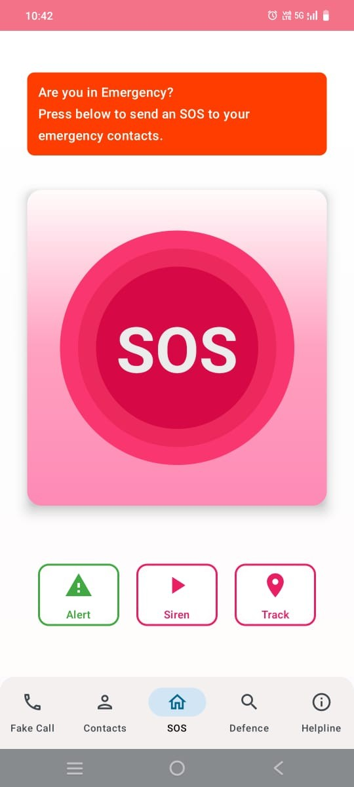
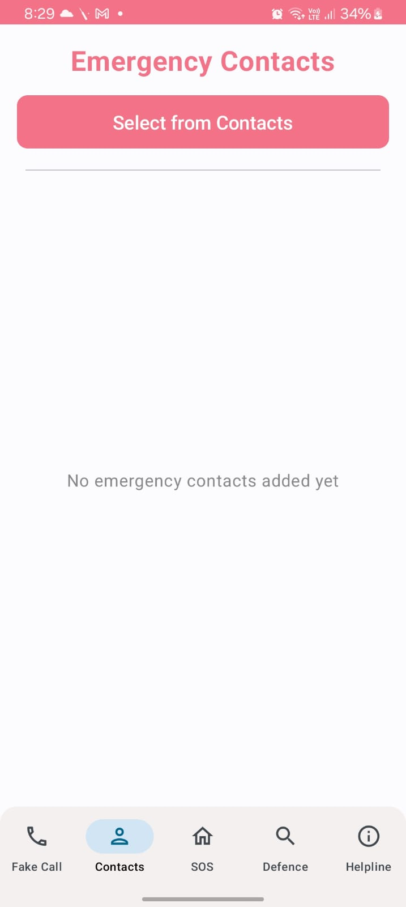
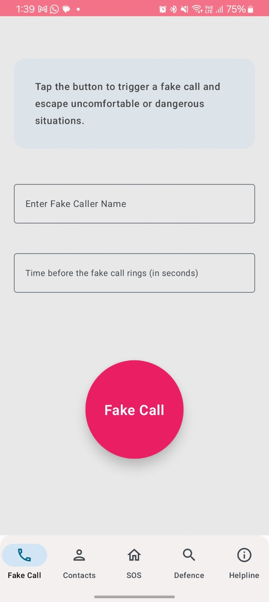
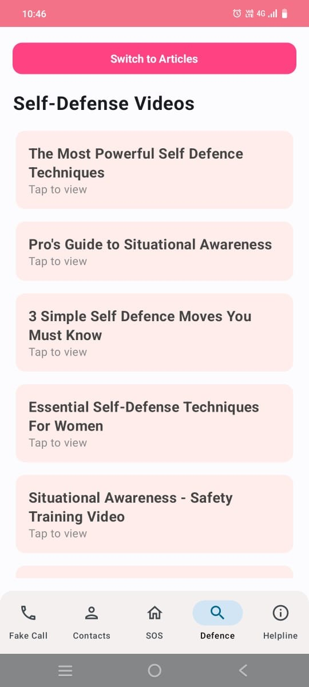
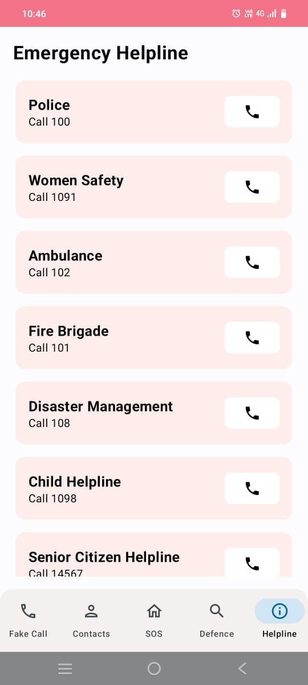

# Women’s Safety App

The *Women’s Safety App* is an Android app built using *Jetpack Compose*. It helps users stay safe by providing features like SOS alerts, live location tracking, fake calls, and safety resources. The app is designed to respond quickly and easily during emergencies.

## Features

- *SOS Alert:* Sends an SMS to all emergency contacts and immediately calls the first saved contact.
- *Live Location Tracking:* Sends location updates every 3 seconds via SMS to all emergency contacts and calls the first contact for continuous monitoring.
- *Shake Detection:* Detects phone shaking and automatically sends an SOS alert.
- *Fake Call:* Schedule a fake call with a custom contact name and timer; defaults to a random number after 3 seconds.
- *Siren:* Plays a loud siren sound.
- *Defence:* Provides self-defense articles and videos.
- *Helpline Numbers:* Quick access to important emergency helpline numbers.

##  Screenshots

| Feature                 | Preview                                                           |
|-------------------------|-------------------------------------------------------------------|
| **SOS Screen**          |          |
| **Contacts Screen**     |  |
| **Fake Call Screen**    |            |
| **Self Defence Screen** |              |
| **Helpline Screen**     |             |

## Tech Stack

- *Android UI:* Jetpack Compose
- *Language:* Kotlin

## APIs Used

- *Fused Location Provider API:* For fetching user location in real-time.
- *SharedPreferences API:* For storing emergency contact data locally.